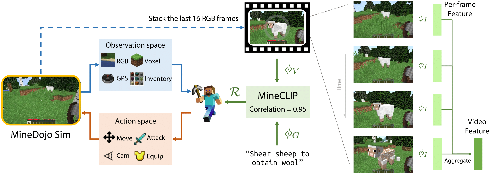

# MineCLIP: Foundation Model for MineDojo
<div align="center">

[[Website]](https://minedojo.org)
[[Arxiv Paper]](https://arxiv.org/abs/2206.08853)
[[PDF]](https://arxiv.org/pdf/2206.08853.pdf)
[[MineDojo]](https://github.com/MineDojo/MineDojo)
[[Open Database]](https://minedojo.org/knowledge_base)
[[Team]](https://minedojo.org/index.html#team)

[](https://pypi.org/project/MineDojo/)
[](https://pytorch.org/)
[](https://github.com/MineDojo/MineCLIP/blob/main/license)
______________________________________________________________________

</div>

MineCLIP is a novel agent learning algorithm that leverages large pre-trained video-language models as a learned reward function. Guided by MineCLIP reward, our trained MineAgents are able to solve a variety of open-ended tasks specified in free-form language without any manually designed dense shaping reward. MineCLIP is trained using [MineDojo video dataset](https://minedojo.org/knowledge_base#youtube).

Specifically, MineCLIP model is a contrastive video-language model that learns to correlate video snippets and natural language descriptions. It is multi-task by design because it is trained on open-vocabulary and diverse English transcripts. With the trained MineCLIP model in the hand, we train language-conditioned MineAgents that take as input raw pixels and predict discrete control. 

In this repo, we provide model code for MineCLIP, MineAgent, and env wrappers for dense reward shaping and sample envs used in our paper. This codebase is under [MIT License](license). 


- [Installation](#Installation)
- [MineCLIP](#MineCLIP)
- [MineAgent](#MineAgent)
- [Dense Reward Shaping](#Dense-Reward-Shaping)
- [Our Paper](#Paper-and-Citation)

# Installation

MineCLIP requires Python ≥ 3.9. We have tested on Ubuntu 20.04. Installing MineCLIP codebase is as simple as:

```bash
pip install git+https://github.com/MineDojo/MineCLIP
```

# MineCLIP

We provide implementation for two MineCLIP variants, `mineclip_attn` and `mineclip_avg`. Here are demo scripts you can run both variants. 

```bash
python3 main/mineclip/run.py variant=attn|avg
```

Choose one variant from `attn` and `avg`. If everything goes well, you should see `Inference successful` printed out.

Pretrained weights are provided for [`attn`](https://drive.google.com/file/d/1uaZM1ZLBz2dZWcn85rZmjP7LV6Sg5PZW/view?usp=sharing) and [`avg`](https://drive.google.com/file/d/1mFe09JsVS5FpZ82yuV7fYNFYnkz9jDqr/view?usp=sharing). You can run demos below to load pretrained weights.

```bash
python3 main/mineclip/load_ckpt.py variant=attn|avg ckpt.path=PATH/TO/DOWNLOADED/CKPT
```

Choose one variant from `attn` and `avg` and specify path for downloaded weights. If everything goes well, you should see `Successfully loaded ckpt` printed out.


# MineAgent

We provide implementation for MineAgent model. To run a MineAgent that takes a single-step observation and outputs a single-step action, run

```bash
python3 main/mineagent/run_single.py
```

If everything goes well, you should see `Inference successful` printed out.

To run a MineAgent demo with an environment in the loop, execute

```bash
python3 main/mineagent/run_env_in_loop.py
```

If everything goes well, you should see a Minecraft client pops up and an agent fight against a spider (though currently it is a random policy).

# Dense Reward Shaping

We provide env wrappers for dense reward shaping used in our paper. Specifically, we provide dense reward shaping for tasks in groups of `animal-zoo` and `mob-combat`. Corresponding wrappers can be found [here](https://github.com/MineDojo/MineCLIP/tree/main/mineclip/dense_reward/animal_zoo) and [here](https://github.com/MineDojo/MineCLIP/tree/main/mineclip/dense_reward/mob_combat).

You can also find two sample env implementations `HuntCowDenseRewardEnv` and `CombatSpiderDenseRewardEnv`. They correspond to tasks "Hunt Cow" and "Combat Spider" in the paper.

# Training Data

We provide [a superset of 640K video clips](https://drive.google.com/file/d/1cLXC64Cu2EJj2nsb4K0ajl8qqX6l0lKd/view?usp=sharing) we used for pre-training. You can subsample from this set and grow start/end timestamps as you like (basically what we did for training MineCLIP).

Format:
```python
{
    "keyword1": list[
        [video_id1, start_timestamp1, end_timestamp1],
        [video_id2, start_timestamp2, end_timestamp2],
        [video_id3, start_timestamp3, end_timestamp3],
    ],
    "keyword2": list[
        [video_id4, start_timestamp4, end_timestamp4],
        ...
    ],
    ...
}
```

# Paper and Citation

Our paper is posted on [Arxiv](https://arxiv.org/abs/2206.08853). If you find our work useful, please consider citing us! 

```bibtex
@inproceedings{fan2022minedojo,
  title     = {MineDojo: Building Open-Ended Embodied Agents with Internet-Scale Knowledge},
  author    = {Linxi Fan and Guanzhi Wang and Yunfan Jiang and Ajay Mandlekar and Yuncong Yang and Haoyi Zhu and Andrew Tang and De-An Huang and Yuke Zhu and Anima Anandkumar},
  booktitle = {Thirty-sixth Conference on Neural Information Processing Systems Datasets and Benchmarks Track},
  year      = {2022},
  url       = {https://openreview.net/forum?id=rc8o_j8I8PX}
}
```

